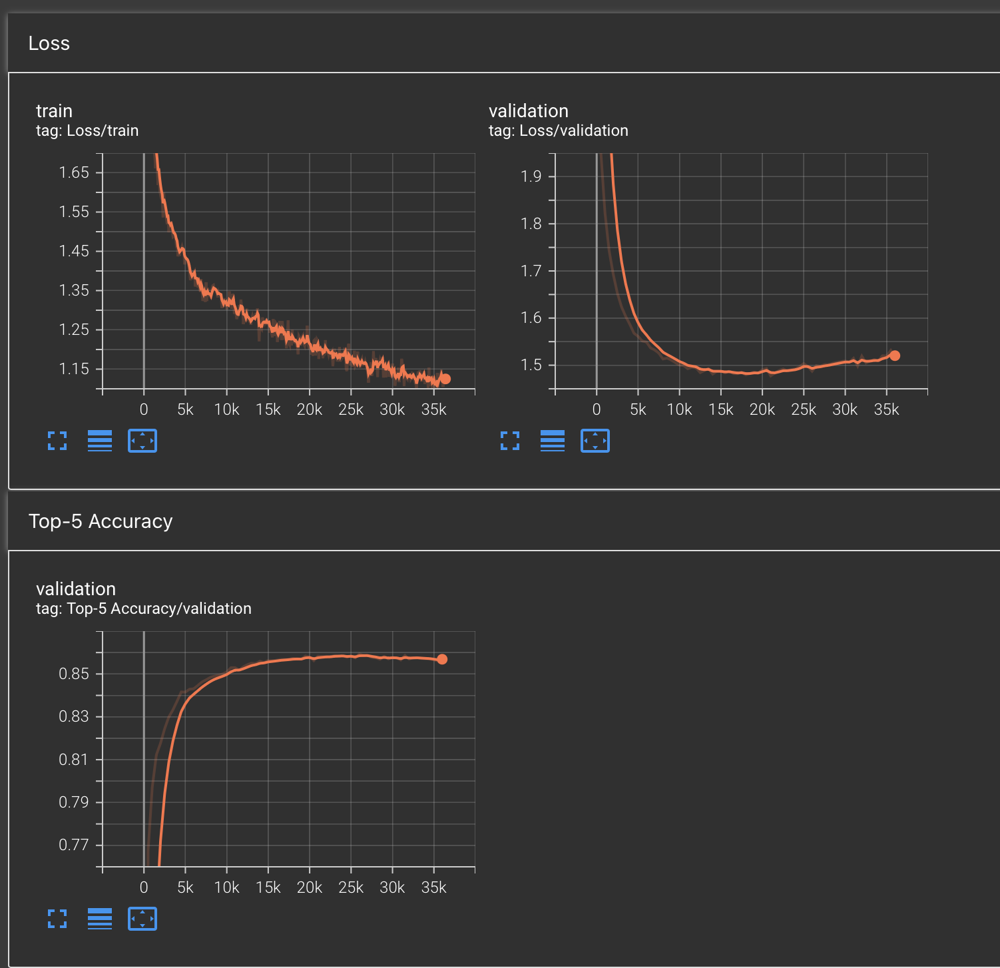

# ML Coding Exercises
Practice work for brushing up some skills.

## GMM
See `GMM.ipynb` as the entry point. 

Mock data from multiple gaussians (2D and 3D) with additive noise and implement the EM algo to fit some of varying complexity of the gaussian (e.g. start with k means, progress to a full covariance matrix). Plot the sampled points and the fit.

## Positional Encoding Exploration
See `PositionalEncoding.ipynb`

Visualize absolute sinusoidal positional encodings along with RoPE. Also visualize the dot products between learned absolute posititional encodings.

## NanoGPT Reimplementation
Reimplement the nanoGPT model from https://github.com/karpathy/nanoGPT without referencing it directly. Train a language model on Tiny Shakespeare: https://github.com/karpathy/char-rnn/blob/master/data/tinyshakespeare/input.txt and generate text from it.

We implement the model from scratch and have a lite config for training on CPU and a heavy version for training on GPU.

See `shakespeare/` for the full implementation. `train.py` is the script to launch training. We write to `logs/` for tensorboard visualization.

`tokenizer.py` is a one time generation script to generate a vocabulary from the text file along with tokenizing the full text into a series of integers based on
the vocabulary. This is saved under `shakespeare/data/` and is used for training.

`dataset.py` contains the dataset class that provides data in batches to the model. It uses the tokenized data from `tokenizer.py` and provides a PyTorch dataset class that can be used with a dataloader. We chunk the data into sequences of fixed length each iteration. The notion of an epoch is not used here as we keep
regenerating chunks from the data.

`model.py` contains the model implementation along with a function that provides the loss to train against.

`train.py` contains the training loop and is used to train the model. We also periodically run validation.

We define two configs: `lite` and `heavy`. `train.py` constructs a desired model by passing in init parameters, then provides
training parameters based on the `train()` function.

`lite` achieves best val loss around `1.71` and a `top-5` token prediction accuracy of `81.6%`.

`heavy` achieves best val loss around `1.48` and a `top-5` token prediction accuracy of `86%`.

Tensorboard (shows early overfitting, so we gather the model with best val loss):

Run by: `python train.py --data_path {path/to/data} --config {lite/heavy}`

We also provide a `generate.py` script to generate text from a trained model under `shakespeare/models/` along with inference configs. We support:
1. Simple sampling
2. Top-k sampling with temperature

This can be run either with oneshot generation or with a prompt.

Run by: `python generate.py --data_path {path/to/data} --config {lite/heavy} --model_path {path/to/model} --length {length} --prompt {prompt}` where `prompt` is optional.
Other options are `--topk-sampling-limit` for optional top-k sampling (defaults to sampling from the full token distribution), `--temperature` for controlling the randomness of predictions.

From very barebones qualitative evaluation, we find this setting to work best for the `heavy` model:
Top-K sampling with temperature with `K=10` and temperature `T=0.8`.

We also implement KV caching (see `shakespeare/inference_engine.py`) and show that it speeds up inference by a factor of `?x` with the above setting. Particularly we go from
`15.59 ms/token` to `?ms/token` with KV caching as measured in generating `1000` tokens.

One learning while doing this: unless there's a strategy I'm missing, KV caching runs into issues once you hit the max sequence length if using absolute positional encodings (inc learned).
I initially trained models with learned absolute encodigns (simple matrix $\Pi\in \mathbb{R}^{T, E}$ where `T` is seq length, `E` is embedding size), but once your KV cache hits `T` entries,
you have to start pruning (LRU). But, then the positions get shifted invalidating the cache every element.

Therefore, I switched to relative positional encodings (RoPE) which allows for the pruning. I didn't see any performance difference wrt validation loss, but we get to realize the speedup this way.
